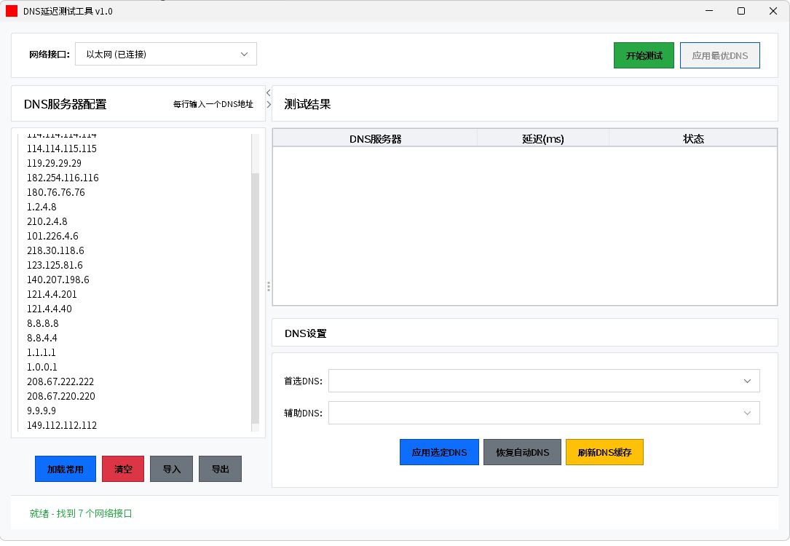

# DNS延迟测试工具

一款基于 Java Swing 的桌面应用，用于批量测试 DNS 服务器延迟，并在 Windows 系统上一键应用最优或指定 DNS 设置，支持恢复自动获取与刷新本地 DNS 缓存。

## 功能特性
- 批量测试 DNS 服务器延迟，结果按延迟自动排序
- 一键应用测试得到的最优 DNS 到指定网卡
- 支持手动选择并应用任意两条测试成功的 DNS
- 一键恢复为自动获取 DNS（DHCP）
- 刷新本地 DNS 缓存
- 导入/导出 DNS 列表，加载常用 DNS 模板
- 现代化 UI（FlatLaf），中文界面，内置中文字体以统一显示

## 平台支持
- Windows 10/11：完整支持（测试、应用/恢复 DNS、刷新缓存）
- 其他平台：主要面向 Windows；如仅运行测试功能，可能需要自行适配系统命令（当前未提供）

## 运行环境
- 操作系统：Windows 10/11（应用/恢复/刷新 DNS 需管理员权限）
- Java：JDK 8 或更高
- Maven：3.6+（用于构建）

## 管理员权限说明
- EXE 方式：右键可执行文件 -> 以管理员身份运行
- JAR 方式：以管理员身份打开命令提示符或 PowerShell，再执行运行命令
- 无管理员权限时，涉及网络设置变更的操作会失败（测试功能不受影响）

## 构建与运行
项目已配置 Maven Shade 插件，默认打包为可运行的 Fat JAR。Windows 下可选生成 EXE。

- 打包 JAR
```bash
mvn -DskipTests package
```
产物位置：`target/dns-test-tool.jar`

- 运行 JAR
```bash
java -jar target/dns-test-tool.jar
```

- 直接以 Maven 运行（可选）
```bash
mvn -q exec:java
```

- 生成 Windows 可执行文件（EXE）
```bash
mvn -P windows-exe -DskipTests package
```
产物位置：`target/DNS延迟测试工具.exe`

## 使用指南
1. 在左侧文本框中输入待测 DNS 地址，每行一条（可点击“加载常用”快速填充）
2. 顶部选择要应用 DNS 的网络接口
3. 点击“开始测试”，等待结果
4. 可选择：
   - “应用最优DNS”：将排序第 1 的 DNS 作为主 DNS，并自动选择次优作为备用
   - “应用选定DNS”：从下拉框手动选择主/辅 DNS
5. 其他：
   - “恢复自动DNS”：将接口恢复为 DHCP 自动获取
   - “刷新DNS缓存”：清空本地 DNS 缓存
   - “导入/导出”：保存或读取 DNS 列表为 txt 文件

提示：应用/恢复/刷新操作需要以管理员身份运行程序。

## DNS 列表格式
- 每行一个条目，支持 IPv4 和 IPv6 地址
- 以 `#` 开头的行为注释，将被忽略
- 允许空行，将被忽略
- 建议使用 IP 地址而非域名作为 DNS 服务器条目

## 工作原理
- 测试命令与流程：优先使用内置 dig 工具对 `www.baidu.com` 的 A 记录进行查询，单个 DNS 连续测试 3 次取平均值；dig 内部超时 1 秒、重试 1 次，外层等待 500ms；平均值超过 300ms 视为失败。
- 失败回退：若 dig 不可用或调用失败，回退到 `nslookup <domain> <dns>`，以进程耗时作为延迟测量。
- 并发与排序：最多并发 10 个任务，所有条目测试完成后按成功优先、延迟升序排序。
- 工具来源：运行时将从资源目录提取 `src/main/resources/dig_path` 下的 `dig.exe` 及所需 DLL 到临时目录并使用；退出时会尝试清理临时文件。
- 平台假设：应用/恢复/刷新 DNS 设置依赖 Windows 命令；其他平台仅可参考测试能力（需自行扩展）。

## 可配置项
以下参数写死在源码中，如需调整请修改源码后重新构建：
- 测试域名：`DnsTester.TEST_DOMAIN`（默认 `www.baidu.com`）
- 单次超时阈值：`DnsTester.TIMEOUT_MS`（默认 300ms）
- 每个 DNS 测试次数：`DnsTester.TEST_COUNT`（默认 3 次，取平均）
- 最大并发：`testMultipleDns` 中创建的线程池大小 `min(10, N)`
- dig 路径：优先使用资源提取的 `dig.exe`；若提取失败，会尝试系统路径（如 `C:\Program Files\BIND\bin\dig.exe` 等）
- 常用 DNS 列表：`DnsTester.getCommonDnsServers()`，可直接在界面编辑或修改源码内置列表

## 性能与限制
- 300ms 失败阈值适合日常网络；在高延迟或跨境网络下可能偏严，可按需上调。
- 当前仅测试 A 记录（IPv4）；未对 AAAA（IPv6）进行延迟测试，可在源码中将查询类型从 `A` 扩展到 `AAAA` 或两者皆测。
- dig 外层等待 500ms；在极慢网络下可能触发超时回退或误判，建议结合实际网络调整参数。
- 测试域名为国内常用站点；面向海外使用时可替换为更贴近目标网络的域名。

## 数据与隐私
- 本应用不会采集或上报任何个人信息或测试结果。
- 测试过程中仅向被测 DNS 发起标准解析请求。
- 应用不会将数据持久化到磁盘（除系统临时目录用于提取运行所需工具外）。

## 日志与诊断
- 运行日志默认输出到标准输出（控制台），包含工具初始化与错误信息。
- 如需保留日志，建议以命令行方式启动并重定向输出。
- 若 EXE 启动无控制台，可改用 JAR 方式运行以便观察日志。

## 依赖
- dnsjava（本地 `lib/` 目录提供 jar）
- SLF4J API（本地 `lib/` 目录提供 jar）
- FlatLaf（Maven 中央仓库）
- emoji-java（仅保留解析能力，界面不显示 emoji）

构建时由 Maven Shade 插件打包为 Fat JAR，无需手动拷贝依赖。

## 目录结构
```
src/
  main/
    java/org/example/dns/    # 源码
    resources/
      font/                  # 字体（含 SourceHanSansSC-Regular-2.otf）
      dig_path/              # Windows 附带工具与依赖
pom.xml                      # Maven 配置（含 shade、exec、launch4j profile）
```

## 故障排查
- 无管理员权限导致“应用 DNS”或“恢复自动 DNS”失败：
  以管理员身份运行程序或 EXE
- 运行后界面中文显示异常：
  确认 `SourceHanSansSC-Regular-2.otf` 随资源被打包（默认已包含）
- 未发现网络接口或接口列表为空：
  确认网卡已启用且系统网络状态正常
- 构建报本地依赖缺失（dnsjava、slf4j-api）：
  确认 `lib/` 目录存在并与 `pom.xml` 中的 systemPath 对应
- 杀毒或安全策略拦截 EXE：
  将构建产物加入白名单，或改用 JAR 方式运行

## 常见问答
- 是否支持 IPv6 测试？
  目前默认仅测 A 记录（IPv4）。可修改源码中 dig 查询类型为 `AAAA`，或双类型测试。
- 是否支持命令行参数配置阈值与并发？
  暂未提供 CLI 参数；可通过修改源码常量并重新构建来定制。
- 是否必须使用内置 dig？
  否。应用会优先使用内置版本；若提取失败，会尝试系统已安装的 dig。
- 能否更换测试域名？
  可以。将 `DnsTester.TEST_DOMAIN` 改为你的目标域名后重新构建。

## 发布与版本
- 版本管理：建议遵循语义化版本。
- 构建产物：
  - Fat JAR：`target/dns-test-tool.jar`
  - Windows EXE：`target/DNS延迟测试工具.exe`
- EXE 基于 Launch4j 生成，JRE 最低版本要求在 `pom.xml` profile 中配置。

## 工具截图


## 贡献
欢迎提交 Issue 与 Pull Request：
- 描述问题与复现步骤，附上系统与 Java 版本
- 提交前请确保可以构建通过，并避免引入平台相关路径


## 致谢
- dnsjava
- FlatLaf
- emoji-java

## 联系方式
- 问题与建议：请在本仓库提交 Issue（推荐）。
- QQ：1926885268
- 邮箱：1926885268@qq.com

## 许可声明
本项目基于 Apache License 2.0 开源发布。您可以在遵循许可条款的前提下自由使用、修改与分发本软件；分发时需保留原始版权与许可声明。完整条款见仓库根目录的 LICENSE 文件，或访问：

- LICENSE 文件：./LICENSE
- 在线版本：http://www.apache.org/licenses/LICENSE-2.0
